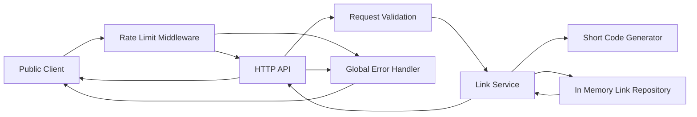

# Component Dependencies and Communication

## Dependency Direction

- HTTP API depends on Public Safety Middleware, Request Validation, and Link Service.
- Link Service depends on Short-Code Generator and In-Memory Link Repository.
- In-Memory Link Repository and Short-Code Generator do not depend on Express or HTTP concepts.
- Public Safety Middleware depends on Express middleware contracts only.

## Dependency Matrix

| Consumer | Dependency | Communication |
|---|---|---|
| HTTP API | Public Safety Middleware | Express middleware pipeline |
| HTTP API | Request Validation | In-process function call |
| HTTP API | Link Service | In-process function call |
| Link Service | Short-Code Generator | In-process function call |
| Link Service | In-Memory Link Repository | In-process function call |

## Data Flow

### Text Alternative

The public client passes through rate-limit middleware to the HTTP API. The HTTP API validates requests and calls the Link Service. The service uses a short-code generator and an in-memory repository, then returns a result to the HTTP API. Known results are returned to the client; unexpected errors go through the global error handler.
