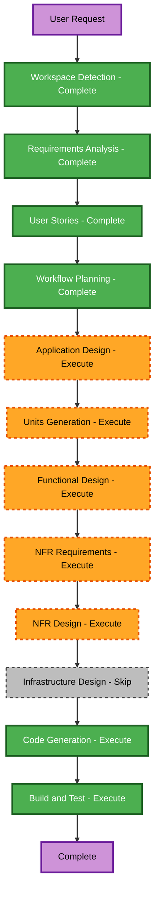

# Execution Plan

## Detailed Analysis Summary

### Change Impact Assessment

- **User-facing changes**: Yes. Public API consumers create and inspect short links; visitors follow them.
- **Structural changes**: Yes. A new Express API service requires HTTP routing, validation, storage, code generation, error handling, and rate limiting components.
- **Data model changes**: Yes. An in-memory link record holds code, destination URL, creation timestamp, and click count.
- **API changes**: Yes. The new public contract includes `POST /api/urls`, `GET /:code`, and `GET /api/urls/:code`.
- **NFR impact**: Yes. The enabled security baseline requires validation, rate limiting, safe errors, public-route designation, and dependency controls.

### Risk Assessment

- **Risk level**: Medium. The service redirects user-supplied URLs and is intended for public hosting, but the first release has one in-memory service and no external infrastructure.
- **Rollback complexity**: Easy. The project is greenfield and has no persisted data or deployed resources.
- **Testing complexity**: Moderate. HTTP routing, redirect semantics, click-count atomicity within the process, validation, rate limiting, and safe errors require automated coverage.

## Workflow Visualization

### Text Alternative

1. Completed: Workspace Detection, Requirements Analysis, User Stories, Workflow Planning.
2. Execute next: Application Design, Units Generation.
3. Execute for the generated unit: Functional Design, NFR Requirements, NFR Design, Code Generation.
4. Skip: Infrastructure Design, because deployment infrastructure is out of scope.
5. Execute last: Build and Test.

## Phases to Execute

### Inception

- [x] Workspace Detection - completed for the greenfield workspace.
- [x] Requirements Analysis - completed and approved.
- [x] User Stories - completed and approved.
- [x] Workflow Planning - plan created; approval pending.
- [ ] Application Design - **EXECUTE**. The new service needs clear component responsibilities, public routes, validation, storage, and security boundaries.
- [ ] Units Generation - **EXECUTE**. The API has several cohesive concerns and a public contract; one documented unit will keep construction work sequenced and traceable.

### Construction

- [ ] Functional Design - **EXECUTE**. Define the link record, validation rules, code uniqueness, and click-count behavior.
- [ ] NFR Requirements - **EXECUTE**. The enabled security baseline and public-hosting intent require a per-unit security assessment.
- [ ] NFR Design - **EXECUTE**. Incorporate rate limiting, safe errors, logging constraints, and dependency controls into the solution design.
- [ ] Infrastructure Design - **SKIP**. No cloud deployment, persistent store, load balancer, gateway, or infrastructure-as-code is in scope.
- [ ] Code Generation - **EXECUTE**. Required to create the API, tests, and repository artifacts.
- [ ] Build and Test - **EXECUTE**. Required to verify unit and HTTP integration behavior and document commands.

### Operations

- [ ] Operations - **PLACEHOLDER**. The AI-DLC operations stage has no current execution workflow, and deployment is out of scope.

## Unit and Change Sequence

1. **Unit: URL Shortener API** - design the in-memory record, public HTTP contract, validation, rate limiting, errors, and test boundaries.
2. **Implementation** - generate the service, tests, dependency manifest and lock file, and current README instructions.
3. **Verification** - run build and automated tests, then provide build-and-test instructions.

## Success Criteria

- A locally runnable Node.js, TypeScript, Express API implements all approved requirements and stories.
- HTTP tests verify creation, validation, redirection, click counting, metadata, unknown-code handling, and safe errors.
- Enabled security requirements are satisfied or explicitly recorded as N/A for the local-only scope.
- README documents setup, run, API usage, tests, limitations, and status.
- Every AI-DLC stage is explicitly approved before the following stage begins.

## Planning Checklist

- [x] Load approved requirements and stories.
- [x] Assess scope, impact, and risk.
- [x] Determine executed and skipped stages.
- [x] Create and validate workflow visualization with a text alternative.
- [x] Update state tracking, README, and audit trail.
- [ ] Obtain explicit approval of this execution plan.
